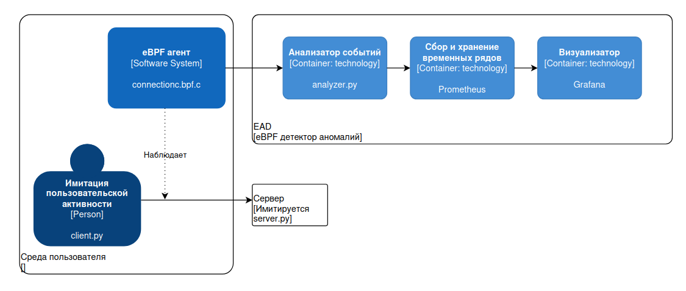
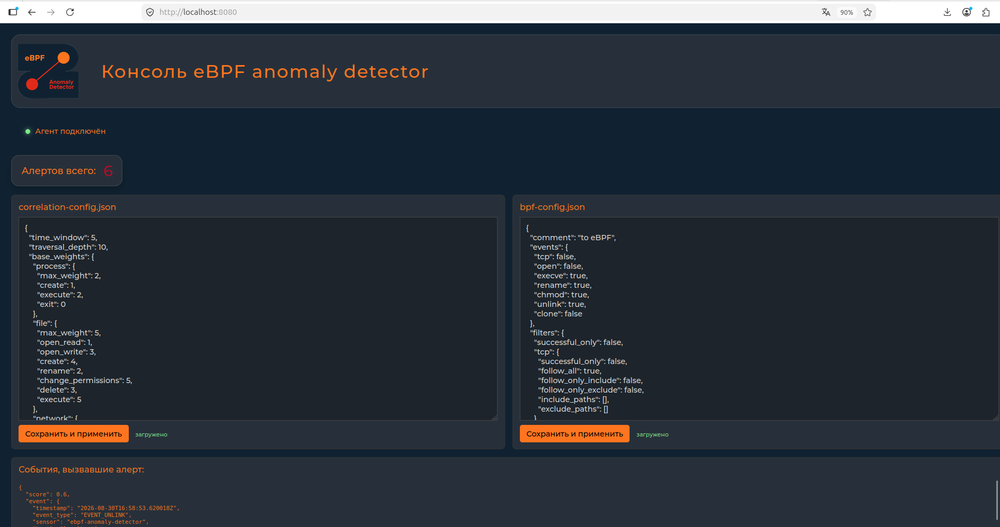
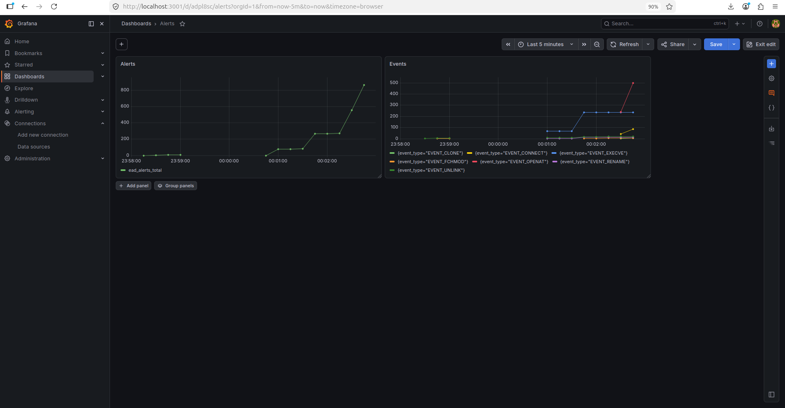

# eBPF Anomaly Detector

eBPF Anomaly Detector - прототип системы обнаружения аномальной активности процессов в Linux. Он собирает события на уровне ядра, восстанавливает связи между процессами, файлами и сетевыми адресами, а затем оценивает их в контексте общей цепочки действий.

Основная цель проекта - обнаружение последствий атак на цепочку поставок программного обеспечения. В таких атаках вредоносный код попадает на хост через доверенный компонент, а отдельное действие при этом часто выглядит нормально. EAD полезен именно тем, что наблюдает эти действия вне контролируемого приложения и оценивает не изолированные системные вызовы, а их причинно-временную последовательность.

Сбор событий, построение графа, базовая корреляция, метрики и доставка алертов реализованы.

## Архитектура



На защищаемом Linux-хосте eBPF-программы подключаются к tracepoint ядра и записывают события в BPF ring buffer.

Агент на Go читает бинарные структуры из ring buffer, применяет фильтры из bpf-config.json и преобразует события в построчный JSON. По постоянному TCP-соединению поток передаётся анализатору

python-анализатор принимает подключения агентов, помещает JSON события в общую очередь и последовательно обрабатывает их корреляционным worker потоком. Он обновляет ориентированный граф, рассчитывает оценку события, экспортирует метрики prometheus и отправляет сформированные алерты в веб-сервис по HTTP 

Веб-сервис показывает состояние агента, счётчик и поток алертов, а также позволяет редактировать рабочие конфигурации

prometheus собирает метрики анализатора, grafana может использовать prometheus как источник данных

Основной поток данных выглядит так:

```
Linux tracepoints -> 
    eBPF collector -> 
            ring buffer -> 
                host/agent ->
                    TCP/JSON ->
                        analyzer ->
                            HTTP alert ->
                                web UI ->
                                    /metrics ->
                                        prometheus ->
                                            grafana
```

Каталоги проекта разделены по ролям: `host/ebpf` содержит eBPF-программы и структуры событий, `host/agent` - загрузчик и агент, `analyzer` - графовый корреляционный движок, `web`- интерфейс и API, `docker` - prometheus и grafana 


## События eBPF

Сборщик отслеживает вход и выход системных вызовов, когда это необходимо для объединения аргументов с результатом операции.  Агент дополняет и нормализует данные перед отправкой

| Событие анализатора | Источник в ядре | Что фиксируется |
|---|---|---|
| `EVENT_CONNECT` | `sock/inet_sock_set_state` | Установленное IPv4 TCP-соединение, адреса и порты источника и назначения |
| `EVENT_EXECVE` | `execve`, `execveat` | Запуск файла, путь, до трёх аргументов, флаги и результат |
| `EVENT_OPENAT` | `open`, `openat` | Открытие, чтение, запись или создание файла, путь, флаги, режим, файловый дескриптор и длительность |
| `EVENT_RENAME` | `rename`, `renameat`, `renameat2` | Старый и новый пути, дескрипторы каталогов, флаги и результат |
| `EVENT_FCHMOD` | `chmod`, `fchmod`, `fchmodat`, `fchmodat2` | Изменение прав доступа, путь или дескриптор, новый режим и результат |
| `EVENT_UNLINK` | `unlink`, `unlinkat` | Удаление файла, путь, флаги и результат |
| `EVENT_CLONE` | `clone`, `clone3` | Создание задачи, идентификатор потомка, clone-флаги, TID, TLS и сигнал завершения |

Набор включённых событий и фильтры задаются в `host/bpf-config.json`. Агент следит за рабочей копией `host/build/bpf-config.json` и применяет изменения без перезапуска


## Работа анализатора

Для каждого события анализатор создаёт или обновляет вершины сущностей в ориентированном мультиграфе NetworkX. Вершинами являются процессы, файлы и сетевые назначения, а рёбрами - действия процесса над объектом. Ребро хранит операцию, временную метку, результат, исходные атрибуты и базовый вес. Текущее состояние графа выгружается в `analyzer/event-graph.html` для отладки

Базовые веса задаются отдельно для процессных, файловых и сетевых операций в `correlation-config.json`, затем нормализуются по максимальному весу своей категории

При корреляции от нового ребра назад выделяется локальный подграф. В него входят только более ранние причинно связанные рёбра в пределах временного окна и максимальной глубины обхода. Вклад каждого найденного события уменьшается с ростом графового расстояния и с возрастом события; временное затухание имеет характер полураспада, поэтому близкий и недавний контекст влияет сильнее. Полученные вклады усредняются в коэффициент локального контекста, которым ограниченно корректируется нормализованный базовый вес

## Сервисы и порты

| Порт | Сервис | Кто подключается |
|---|---|---|
| `9000/TCP` | analyzer | Агент отправляет поток событий в формате JSON |
| `9200/HTTP` | Метрики анализатора | prometheus собирает `/metrics`, веб-сервис читает оттуда счётчик алертов и состояние подключений |
| `8080/HTTP` | Веб-консоль и API | analyzer отправляет алерты в `POST /api/alerts` |
| `9090/HTTP` | prometheus | grafana и пользователь обращаются к prometheus API и интерфейсу |
| `3001/HTTP` | grafana | Внешний порт `3001` перенаправляется на порт `3000` контейнера |

### Веб-консоль


### Дашборды



## BEFORE START

```bash
# из корня проекта
python3 -m venv .venv
source .venv/bin/activate
pip install prometheus-client networkx pyvis
```

Сборка агента и веб-сервиса:

```
make -C host
make -C web
```

Если требуется обновление заголовка `host/ebpf/vmlinux.h`:

```
sudo bpftool btf dump file /sys/kernel/btf/vmlinux format c > host/ebpf/vmlinux.h
```

Запуск компонентов:

```bash
# из корня проекта
python -m analyzer

./web/build/web

cd host/build
sudo ./agent

docker compose -f docker/docker-compose.yml up -d
```
